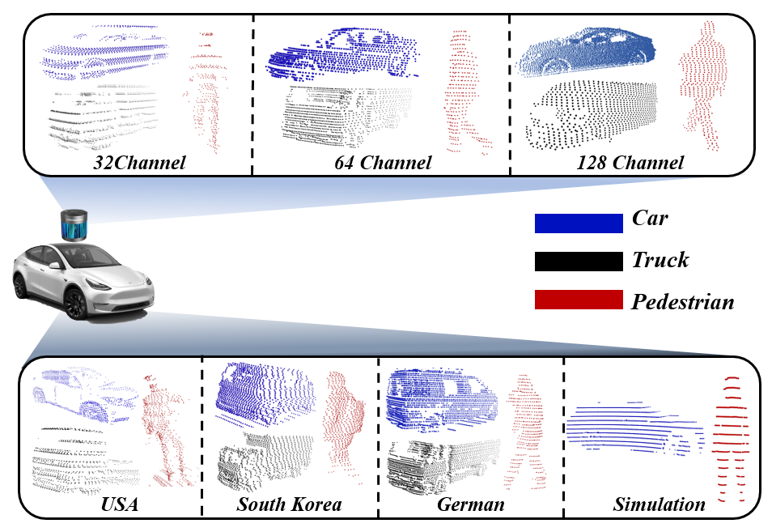

# Multi-view Structural Convolution Network for Robust Cross-Source Point Cloud-based Classification
Created by Younggun Kim, University of Central Florida, USA, and Soomok Lee, Ajou University, South Korea.

This repository is based on our work submitted to IEEE Access, 2024. The paper will be made available later.


## Introduction




Point cloud representation has garnered significant attention in computer vision, particularly in the realm of autonomous vehicles. However, adapting deep learning models to point cloud data remains challenging due to the diverse nature of datasets and sensor technologies. To address this, we introduce the **Multi-View Structural Convolution Network (MSCN)**, a model designed for domain-invariant point cloud recognition.    

Moreover, MSCN is trained on unseen domain point clouds derived from existing datasets, enabling it to learn domain-invariant features. This ensures robust performance across different datasets and sensor configurations.

## Environment
```
Linux Ubuntu 20.04
Python 3.8.19
PyTorch 1.10.1
Cuda 11.8
```

## 


## Installation
There are requirements to run this code. Please follow commands below: 

```
git clone https://github.com/MLMLab/MSCN.git
cd MSCN
pip3 install -r requirements.txt
```


## Dataset
The dataset used in this work can be accessed at the following link:

[Point Cloud Dataset](https://share.mlmlab.synology.me/sharing/nWUDWeFaR)

Please download all datasets into the MSCN folder and ensure the following dataset structure:

```
Your_paths/MSCN/dataset/
│
├── kitti_3/
│   ├── car/
│   │   ├── test/
│   │   └── train/
│   ├── pedestrian/
│   │   ├── test/
│   │   └── train/
│   └── truck/
│       ├── test/
│       └── train/
│
├── nuscenes_3/
│   ├── car/
│   │   ├── test/
│   │   └── train/
│   ├── pedestrian/
│   │   ├── test/
│   │   └── train/
│   └── truck/
│       ├── test/
│       └── train/
│
├── pankyo_3/
│   ├── car/
│   │   ├── test/
│   │   └── train/
│   ├── pedestrian/
│   │   ├── test/
│   │   └── train/
│   └── truck/
│       ├── test/
│       └── train/
│
├── kitti_2/
│   ├── car/
│   │   ├── test/
│   │   └── train/
│   └── pedestrian/
│       ├── test/
│       └── train/
│
├── nuscenes_2/
│   ├── car/
│   │   ├── test/
│   │   └── train/
│   └── pedestrian/
│       ├── test/
│       └── train/
│
├── pankyo_2/
│   ├── car/
│   │   ├── test/
│   │   └── train/
│   └── pedestrian/
│       ├── test/
│       └── train/
│
└── simulation_2/
    ├── car/
    │   ├── test/
    │   └── train/
    └── pedestrian/
        ├── test/
        └── train/
```

For real-to-real domain change scenarios, you can use kitti_3, nuscenes_3, and pankyo_3. For sim-to-real domain change scenarios, you can use simulation_2, kitti_2, nuscenes_2, and pankyo_2.

## MSCN Framework


### MSCN Training

If you want to test models with a pretrained model, please skip this step and proceed to the **MSCN Testing** section.

To train MSCN, run `base_main.py` or `base_train.sh` with the following commands:

```
python3 base_main.py -model mscn -classnum <2 or 3> -cuda <your device> -mode train -dataset <your paths/MSCN/dataset/train_dataset> -record <your paths/MSCN/log/train/train_log_file.log> -save <your paths/MSCN/saved_model/model_file.pkl> -support 1 -neighbor 3 -epoch 10 -bs 16 
```

or

```
taskset -c 0-3 sh base_train.sh
```

You may need to adjust several arguments such as -model, -classnum, and -dataset for your specific needs. You can also train other models by modifying the -model argument. For example, if you want to train GCN, set the -model argument to gcn in `base_train.sh`.

Note that PointNet, PointMLP, PointNeXt, and DGCNN require point cloud normalization. If you want to train these networks, add the -normal argument in `base_train.sh`.


To train PointNeXt, use the following commands:

```
cd pointNext

python3 base_main.py -model pointNext -classnum <2 or 3> -cuda <your device> -mode train -dataset <your paths/MSCN/dataset/train_dataset> -record <your paths/MSCN/pointNext/log/train/train_log_file.log> -save <your paths/MSCN/pointNext/saved_model/model_file.pkl> -epoch 10 -bs 16 -normal
```

or

```
cd pointNext

taskset -c 0-3 sh base_train.sh
```

### MSCN Testing

To test MSCN, `run base_main.py` or `base_test.sh` with the following commands:

```
python3 base_main.py -model mscn -classnum <2 or 3> -cuda <your device> -mode test -dataset <your paths/MSCN/dataset/target_dataset> -record <your paths/MSCN/log/test/test_log_file.log> -load <your paths/MSCN/saved_model/model_file.pkl> -support 1 -neighbor 3 -epoch 10 -bs 16 
```

or

```
taskset -c 0-3 sh base_test.sh
```

You can also test models with pretrained models. Here are two example commands for domain change scenarios: transferring from the KITTI dataset to the Pankyo dataset and from the simulation dataset to the KITTI dataset.

To transfer from KITTI to Pankyo, use the following command:

```
python3 base_main.py -model mscn -classnum 3 -cuda <your device> -mode test -dataset <your paths/MSCN/dataset/pankyo_3> -record <your paths/MSCN/log/test/MSCN_kitti_to_pankyo.log> -load <your paths/MSCN/pretrained_model/MSCN/MSCN_KITTI_3_EP10.pkl> -support 1 -neighbor 3 -epoch 10 -bs 16 
```

To transfer from simulation to KITTI, use the following command:

```
python3 base_main.py -model mscn -classnum 2 -cuda <your device> -mode test -dataset <your paths/MSCN/dataset/kitti_2> -record <your paths/MSCN/log/test/MSCN_sim32_to_kitti.log> -load <your paths/MSCN/pretrained_model/MSCN/MSCN_SIM32_EP10.pkl> -support 1 -neighbor 3 -epoch 10 -bs 16 
```

To test the performance of PointNeXt in the pointNext folder, use the following command:

```
cd pointNext

python3 base_main.py -model pointNext -classnum <2 or 3> -cuda <your device> -mode test -dataset <your paths/MSCN/dataset/target_dataset> -record <your paths/MSCN/pointNext/log/test/test_log_file.log> -load <your paths/MSCN/pointNext/saved_model/model_file.pkl> -epoch 10 -bs 16 -normal
```

## Progressive Domain Expansion


To train MSCN with unseen domain point clouds and evaluate the effects of this process, we adopt the Progressive Domain Expansion Network (PDEN) with some modifications.

### Training Phase

You can generate arbitrary domain point clouds from a specific dataset and alternately train MSCN with these point clouds. We define MSCN trained with both source and generated point clouds as MSCN+. To train MSCN+, you need a pretrained MSCN as the initial encoder. Please train MSCN before this step and load it. Alternatively, you can use our pretrained MSCN available at `your_path/MSCN/pretrained_model/Initial_encoder_for_domain_gen/`.

Then, use the following commands to train MSCN+ with a pretrained MSCN:

```
python3 domain_gen_main.py -classnum <2 or 3> -cuda <your device> -mode train -dataset <your paths/MSCN/dataset/train_dataset> -record <your paths/MSCN/log/test/test_log_file.log> -load <your paths/MSCN/pretrained_model/Initial_encoder_for_domain_gen/model_file.pkl> -save <your paths/MSCN/saved_model/MSCN_with_unseen_domain/train_dataset> -support 1 -neighbor 3 -epoch 10 -bs 16 -w_cls 1.0 -w_cyc 20 -w_info 0.1 -w_div 2.0 -div_thresh 0.5 -w_tgt 1.0 -gen_name adain -tgt_epochs 30 -tgt_epochs_fixg 15 -n_tgt 20 -max_tgt 19 -save_img 0\
```

or

```
taskset -c 0-3 sh domain_gen_train.sh
```

If you want to set the initial encoder to your own model, please revise the path of the trained MSCN to `your_paths/MSCN/saved_model/Initial_encoder_for_domain_gen/initial_encoder_file.pkl`.


### Test phase

If you set the '-n_tgt' argument to 19 during the training step, you will have 19 different options of MSCN+ to choose for testing. To find the optimal MSCN+, you need to manually test all 19 cases using the following command:


```
taskset -c 0-3 sh domain_gen_test.sh
```

Pretrained optimal MSCN+ are also available at `your_paths/MSCN/pretrained_model/MSCN_with_unseen_domain/model_file.pkl`. Please run the following command to test MSCN+ with our optimal parameters:

```
python3 base_main.py -classnum <2 or 3> -cuda <your device> -mode test -dataset <your paths/MSCN/dataset/target_dataset> -load <your paths/MSCN/pretrained_model/MSCN_with_unseen_domain/MSCN_with_unseen_domain_train_dataset.pkl> -support 1 -neighbor 3 -bs 16
```

## Acknowledgment
The comparison methods in this library are derived from [PointNet](https://github.com/charlesq34/pointnet), [PointNeXt](https://github.com/guochengqian/PointNeXt), [PointMLP-PyTorch](https://github.com/ma-xu/pointMLP-pytorch), [DGCNN](https://github.com/WangYueFt/dgcnn), and [GCN](https://github.com/zhihao-lin/3dgcn). 

The code for generating point clouds of arbitrary unseen domains from a specific source dataset is constructed based on [PDEN](https://github.com/lileicv/PDEN).
